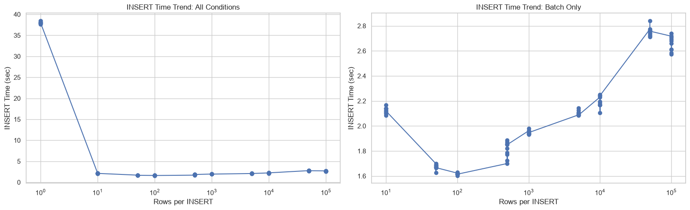

# Django Bulk INSERT 성능 분석

## 서론: 이 분석을 시작한 배경

이 데이터 분석을 시작하기 전에 여러 웹 자료를 찾아보았습니다. 그 과정에서 bulk insert가 단건 insert보다 중규모 이상의 데이터에서 큰 성능 향상을 보일 수 있다는 설명을 접했습니다. 또한 bulk insert에서도 batch scale이 클수록 항상 좋은 것은 아니며, 특정 batch size까지는 시간이 감소하다가 그 이후 다시 증가하는 추세가 나타날 수 있다는 내용도 확인했습니다.

이 내용을 바탕으로, 단건 insert보다 bulk insert가 빠른 이유에는 트랜잭션에 사용되는 고정 비용의 감소가 있을 것이라고 생각했습니다. 다만 batch size를 키워도 무조건적인 이득이 아니라면, 한 트랜잭션을 처리할 때 드는 비용과 트랜잭션 횟수가 줄어들며 절감되는 비용 사이에 상관관계 또는 균형점이 있을 것이라고 보았습니다.

따라서 이 분석은 “bulk insert가 일반적으로 빠르다”는 설명을 그대로 결론으로 받아들이는 것이 아니라, **현재 Django benchmark의 데이터가 이 가정을 어디까지 확인할 수 있을지** 확인하는 과정입니다.

## 실험 전 가정

아래 네 가지는 실험을 시작하기 전에 세운 가정입니다. 이후 결과는 각 가정을 유지·보완·보류하는 방식으로 해석합니다.

1. 단건 insert에서는 한 건마다 고정적인 트랜잭션 비용이 발생하고, bulk insert에서는 전체 데이터 수 `n / batch size`에 해당하는 트랜잭션 비용이 발생하므로 단건 insert보다 bulk insert의 소요 시간이 적을 것이다.
2. batch size가 커질수록 한 번의 트랜잭션 비용은 단건 insert와 비교했을 때 더 커질 것이다.
3. batch size가 커질 때 트랜잭션 비용의 증가 비율과 트랜잭션 횟수 감소로 인한 비용 절감폭이 역전되는 지점이 있을 것이다.
4. Django에서 bulk insert를 수행하기 전 전체 데이터에 대해 instance 변환을 반복문으로 수행하므로, 특정 건수 이하에서는 단건 insert가 비용이 더 적을 것이다.

## 실험 조건과 실행 모델

- 전체 처리량은 모든 조건에서 **100,000건**, 조건별 반복은 **10회**입니다. `insert_size`는 전체 건수가 아니라 한 SQL INSERT에 넣으려 한 행 수입니다.
- 단건 조건은 `BookList.objects.create()`를 100,000번 호출했습니다.
- batch 조건은 먼저 100,000개의 `BookList` instance를 만든 뒤 `bulk_create(book_list, batch_size)`를 한 번 호출했습니다.
- CODEX를 사용하여 해당 보고서를 보완하고 수정할 때 알려온 사실에 따르면 현재 SQLite의 행당 7개 입력 필드와 최대 parameter 수를 기준으로, 한 SQL INSERT의 실제 최대 행 수는 **35,714건**입니다. 따라서 설정값 `50,000`과 `100,000`은 모두 유효 batch size가 35,714건으로 제한되어 SQL INSERT 문 수가 각각 3개로 같습니다.

| 설정 batch size | 유효 SQL batch size | 100,000건의 추정 SQL INSERT 문 수 |
|---:|---:|---:|
| 10 | 10 | 10,000 |
| 100 | 100 | 1,000 |
| 500 | 500 | 200 |
| 1,000 | 1,000 | 100 |
| 50,000 | 35,714 | 3 |
| 100,000 | 35,714 | 3 |

## 가정에 따른 분석 결과

### 핵심 결과

- 전체 100,000건을 처리한 현재 조건에서 `batch_size=100`이 INSERT 평균 **1.617초**, 전체 평균 **1.951초**로 가장 빨랐습니다. 단건 INSERT 평균 **38.013초**보다 INSERT 기준 **23.5배** 빠릅니다.
- batch size를 크게 한다고 시간이 계속 줄지는 않았습니다. INSERT 시간은 `10 → 100`에서 감소했지만, `100 → 500`부터 다시 증가했습니다.
- 이 패턴은 가정 3의 “역전 지점”으로 볼 수도 있습니다. 다만 아래 코드 점검 결과, 이 실험의 `n / batch size`는 트랜잭션 수가 아니라 SQL INSERT 문 수의 추정치이므로 트랜잭션 비용만으로 원인을 단정할 수는 없습니다.

| 실험 전 가정 | 데이터를 통한 결과 | 현재 데이터의 근거 | 
|---|---|---|
| 1. 단건마다 고정 트랜잭션 비용이 발생하고 bulk는 `n / batch size`만큼 발생한다 | 부분 지지 | `batch_size=100`의 INSERT 평균은 1.617초로 단건 38.013초보다 23.5배 빠름 | 
| 2. batch가 클수록 한 트랜잭션 비용이 증가한다 | 지지 | SQL 문당 시간의 단순연산을 통한 트랜잭션 비용은 `10`에서 0.000212초, `100`에서 0.001617초, `1,000`에서 0.019483초로 나타남 |
| 3. 비용 절감폭과 증가폭이 역전되는 지점이 있다 | 지지 | INSERT 평균이 `10 → 100`에서 23.8% 감소하고 `100 → 500`에서 12.1% 증가 |
| 4. instance 변환 비용 때문에 소규모에서는 단건이 나을 수 있다 | 부분 지지 | 측겅값을 기준으로 단순연산 시 `손익분기점 N = 0.337509 / 0.000380129 ≈ 887.9건`으로 기대와 동일한 결과를 볼 수 있지만 실제 측정결과가 아니므로 명확하지 않음 |

### 가정 1에 따른 분석 결과: 단건 INSERT와 bulk INSERT의 차이

단건 조건은 `create()`를 100,000번 호출하고, batch 조건은 100,000개 instance를 만든 뒤 `bulk_create()`를 한 번 호출합니다. 단건 대비 batch 100의 23.5배 성능 차이는 가정 1의 “bulk insert가 더 빠를 것”이라는 기대를 부분적으로 만족합니다.

### 가정 2와 3에 따른 분석 결과: batch size 증가에 따른 비용의 변화와 역전 지점

`batch_size=10`에서 100으로 올리면 추정 SQL INSERT 문 수는 10,000개에서 1,000개로 줄고 평균 INSERT 시간도 2.123초에서 1.617초로 23.8% 감소했습니다. 반면 100에서 500으로 올리면 문 수는 1,000개에서 200개로 더 줄지만, 평균 INSERT 시간은 1.812초로 12.1% 증가했습니다.

즉, **문 수를 줄이는 이득이 항상 더 크지는 않으며 batch 100 근처에서 시간이 가장 낮아지는 관측값**이 나왔고 이는 가정 2, 3의 "batch size 증가에 따른 비용 변화와 그에 따른 역전 지점이 있을 것"이라는 기대를 만족합니다.

### 가정 4에 따른 분석 결과: Django instance 변환과 소규모 전체 건수

측정값 기준으로 단건 INSERT의 **average_row_insert_sec** 평균은 **0.000380129초**, instance build 1회 평균은 **0.337509초**입니다. 100,000건을 처리한 build 시간을 건당으로 나누면 다음과 같습니다.

    0.337509 / 100,000 = 0.000003375초/건

따라서 **약 0.00000338초/건**이며, instance build 단계만 보면 단건 INSERT보다 약 **112.6배** 작습니다.

#### 단건 INSERT와 instance build 1회만 비교한 손익분기점

**고정된 instance build 1회**와 단건 INSERT를 단순 비교하면:

    단건 INSERT 추정 시간(N) = N × 0.000380129
    instance build 1회 = 0.337509
    손익분기점 N = 0.337509 / 0.000380129 ≈ 887.9건

| 전체 건수 N | 단건 INSERT 추정 | instance build 1회 | 이 두 비용만 비교 |
|---:|---:|---:|---|
| 500 | 0.1901초 | 0.3375초 | 단건 INSERT |
| 750 | 0.2851초 | 0.3375초 | 단건 INSERT |
| 약 888 | 약 0.3375초 | 0.3375초 | 거의 동일 |
| 1,000 | 0.3801초 | 0.3375초 | instance build |

즉, **이 두 항만 비교하면 약 888건 이하에서는 단건 INSERT가 더 빠르고, 888건을 넘으면 instance build 1회가 더 빠릅니다.** 따라서 가정 4의 기대를 만족하지만 실제 측정을 통한 결과가 아니므로 확정할 수 없습니다.

### 시각화

*전체 조건과 batch 조건만을 나누어 본 평균 INSERT 시간 추세입니다. 100,000건 처리 기준으로 `batch_size=100`이 최저점입니다.*

*SQL INSERT 문 수가 줄어도 시간이 계속 감소하지 않는다는 점을 보여 줍니다. 이 그래프의 x축은 트랜잭션 수가 아니라 추정 SQL INSERT 문 수입니다.*

현재 100,000건 benchmark에서는 **insert_size=100**이 INSERT 평균 **1.617초**, 전체 평균 **1.951초**로 가장 좋았습니다.

### 다음 실험 구상

#### 소규모 데이터와 batch scale의 상관관계 분석

50~500 구간은 **50, 75, 100, 125, ... , 500**처럼 25건 간격으로 촘촘하게 비교하고, 각 조건을 동일한 반복 수와 warm-up 정책으로 재측정합니다. 동시에 전체 처리량도 **100, 250, 500, 750, 1,000건**으로 별도 고정해 **instance build + DB INSERT + total**을 함께 측정해야 소규모에서 단건과 batch 중 어느 쪽이 실제로 빠른지 판단할 수 있습니다.

## 참고자료

아래 자료는 일반적인 INSERT/BULK INSERT 개념을 알기위한 참고자료이며, 위 수치의 근거는 현재 benchmark 결과와 실행 코드입니다.

[\[ SQL \] INSERT와 BULK INSERT의 차이, Infile Load 방식에 대해](https://cherish-days02.tistory.com/611#%EB%B9%84%EC%9A%A9%20%EC%B8%A1%EB%A9%B4%EC%97%90%EC%84%9C%EC%9D%98%20%EA%B8%88%EC%95%A1%EC%A0%81%20%EC%B0%A8%EC%9D%B4-1-2)
